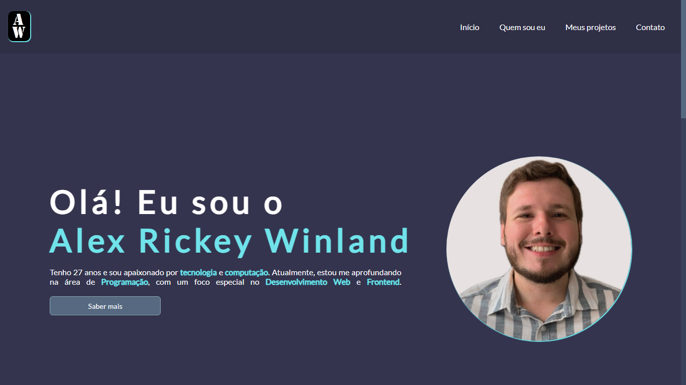

## **README.md: Portfólio Pessoal - Um Vislumbre do Meu Mundo Digital** 

**O que é esse projeto?**

Esse projeto é meu portfólio pessoal, criado com o objetivo de apresentar minhas habilidades e projetos como desenvolvedor web. É como um cartão de visitas digital onde você pode conhecer um pouco mais sobre mim e meu trabalho.

**Como funciona?**

* **Design Responsivo:** Adapta-se perfeitamente a qualquer dispositivo, seja um computador, tablet ou smartphone.
* **Menu Interativo:** Navegue facilmente entre as diferentes seções do meu portfólio.
* **Seção de Projetos:** Aqui você encontrará uma lista dos meus projetos, com links para os repositórios no GitHub.
* **Informações Pessoais:** Descubra um pouco mais sobre minha jornada na programação e meus objetivos.
* **Contato:** Entre em contato comigo através das minhas redes sociais.

**Tecnologias Utilizadas:**

* **HTML:** A estrutura básica da página.
* **CSS:** Responsável pelo estilo visual e layout.
* **JavaScript:** Adiciona interatividade e dinamismo.
* **GitHub:** Hospeda o código fonte do projeto e permite que outros desenvolvedores contribuam.
* **Google Fonts:** Fornece as fontes utilizadas no projeto.

**Como contribuir:**

Sinta-se à vontade para contribuir com este projeto! Se você encontrar algum bug ou tiver alguma sugestão de melhoria, abra um issue ou um pull request no GitHub. 

**Agradecimentos:**

Agradeço a todos que contribuíram para a criação deste projeto, especialmente à comunidade open-source.

**Vamos construir juntos!**

Se você gostou do meu portfólio, não hesite em me seguir nas redes sociais e conferir meus outros projetos. 
