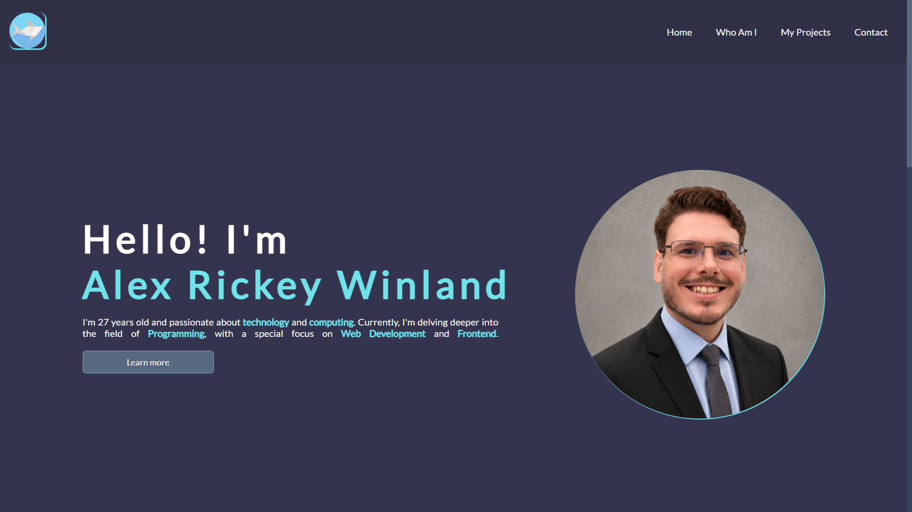

# **Personal Portfolio: A Glimpse Into My Digital World** 

**What is this project?**

This project is my personal portfolio, built to showcase my skills and projects as a web developer. Think of it as a digital business card where you can learn a bit more about me and see my work.

**Key Features:**

* **Responsive Design:** Fits perfectly on any device, whether it's a desktop, tablet, or smartphone.
* **Interactive Menu:** Easily navigate through the different sections of my portfolio.
* **Projects Section:** Here you'll find a list of my projects, including links to their GitHub repositories.
* **About Me:** Learn a bit more about my programming journey and my professional goals.
* **Contact:** Get in touch with me through my social media links.

**Technologies Used:**

* **HTML:** The core structure of the page.
* **CSS:** Responsible for the visual styling and layout.
* **JavaScript:** Adds interactivity and dynamic elements.
* **GitHub:** Hosts the project's source code and allows other developers to contribute.
* **Google Fonts:** Provides the typography used across the project.

**How to contribute:**

Feel free to contribute to this project! If you find a bug or have any suggestions for improvement, please open an issue or submit a pull request on GitHub. 

**Let's build together!**

If you like my portfolio, don't hesitate to follow me on social media and check out my other projects.
